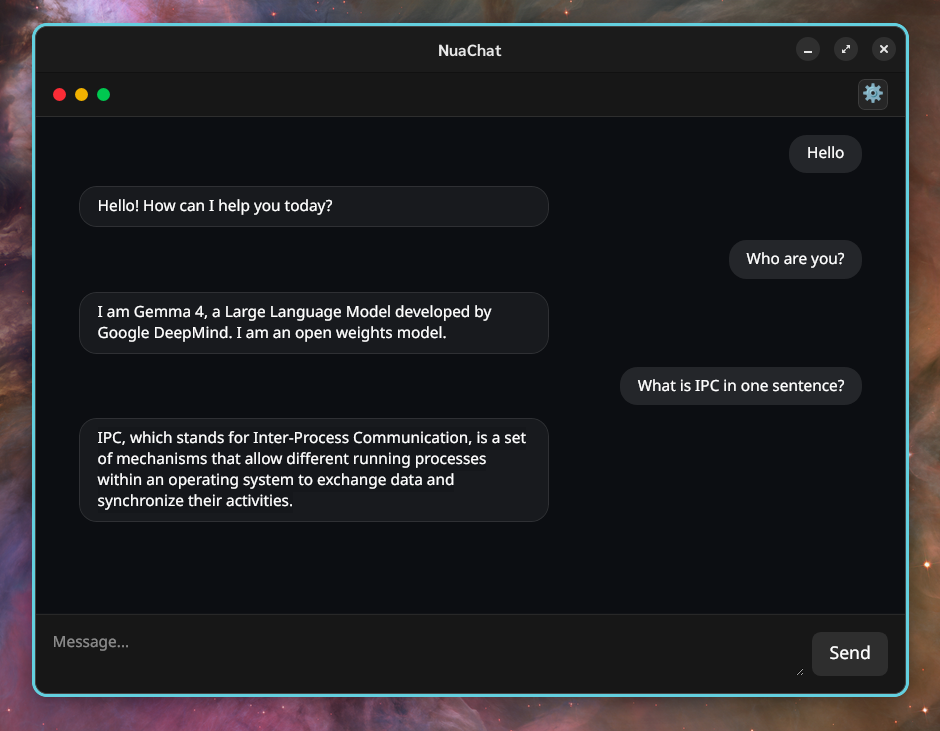

# NuaChat

A Rust-based AI runtime system with IPC messaging, dynamic model selection, and multi-provider support.

NuaChat is an AI-native chat application built around a Rust core and a modern frontend. It is designed as a runtime layer for AI interaction, and serves as the foundation for a broader platform: NuaCode.

<p align="center">
  
</p>

---

## Overview

NuaChat focuses on separating the UI from the execution layer:

- Rust handles execution and routing
- IPC connects frontend and runtime
- Model providers are pluggable
- Models are discovered dynamically at runtime

This structure allows the system to evolve beyond a simple chat interface into a programmable AI runtime.

---

## Architecture
Frontend (React)
↓
IPC (JSON messaging)
↓
Rust Core (Router)
↓
Model Provider (Ollama)
↓
Response → UI

---

## Current Status

The system is functional but intentionally minimal.

### Implemented

- IPC communication between React and Rust
- Request routing in Rust (`chat`, `list_models`)
- Dynamic model loading from Ollama (`/api/tags`)
- Model selection from UI is applied at runtime
- Basic chat request/response flow

### Not Yet Implemented

The current system is still "stateless" and focused on core infrastructure:

- No conversation history (each request is independent)
- No system prompt support
- No memory or context management
- No streaming responses
- Limited error handling

---

## Capabilities

- Select models dynamically from the UI
- Send a message through the Rust runtime
- Receive responses from local models (Ollama)
- Switch models without restarting the application

---

---

## Installation

### Requirements

- Rust (latest stable)
- Node.js (v18+ recommended)
- Ollama (for local model provider)

---

### 1. Clone the repository

```bash
git clone git@github.com:bombman/nuachat.git
cd nuachat
```

---

2.Start Ollama
Make sure Ollama is running and at least one model is available

2.Run Rust core
```bash
cd crates
cargo run
```

4.Run frontend
Open a new terminal
```bash
cd frontend
npm install
npm run dev
```

## Roadmap

### Next Steps

- Streaming responses (real-time token output)
- Error handling (provider unavailable, invalid model)
- Model caching

### Core Improvements

- Typed IPC (strict schema using Rust enums)
- Conversation state and history management
- System prompt support

### Multi-Provider Support

- OpenAI integration
- OpenRouter integration
- Provider selection from UI

### Platform Direction (NuaCode)

- Plugin system (tools and agents)
- Code execution and file operations
- AI-assisted development workflows

---

## Vision

NuaChat is the foundation for an AI-native development environment.

The goal is to move from:
- UI-driven AI usage

to:
- Runtime-integrated AI systems

---

## Tech Stack

- Rust (core runtime)
- React (frontend)
- IPC (WebView bridge)
- Ollama (local model provider)

---

## Status

- Early-stage but functional
- Clean architecture with minimal features
- Focused on building a solid runtime foundation

---

## License

This project is licensed under the Apache License 2.0.

See the [LICENSE](./LICENSE) file for details.